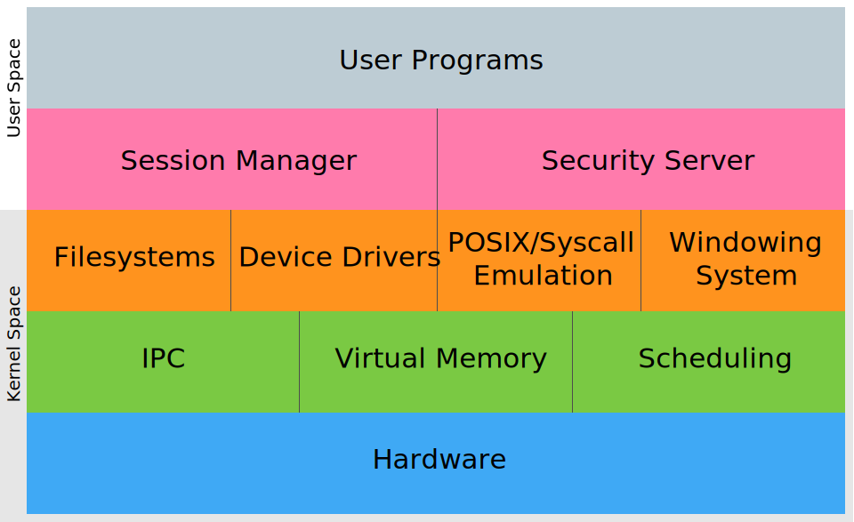

# PMK Design

PMK is built as a traditional microkernel, and thus is based on an efficient IPC mechanism, virtual memory, and an intelligent scheduler to make the most of CPU cycles.

Due to the nature of microkernels, device drivers, filesystems, POSIX/syscalls, and other such requirements for a fully-functional operating system are located outside of the kernel, in a privileged region of programs.

Unlike userspace programs, these privileged programs can access the hardware directly, allocate memory in whatever manner they deem fit, and have complete control over their own memory maps. This, for example, allows drivers to map a peripheral into their memory space, while being protected from other drivers, malfunctioning hardware, and bugs in the kernel itself.

This segregation provides means for isolating driver problems. A crashed video driver may lead to the user's graphical session being terminated while the driver is relaunched, but will not cause data loss that is usually associated with malfunctioning drivers. In addition, the core system will be unaffected by this. It will simply notice the crashed driver and restart it.

## IPC
The core feature of a microkernel is IPC, or interprocess communication. It's the core on which all other features are built, and what enables the kernel to keep services like networking and drivers outside of its codebase.

For this reason, it has to be implemented in such a way that it is incredibly fast. Instead of trying to write one IPC mechanism that works decently to cover as many different cases as possible, PMK exposes three kinds of IPC:

### Short IPC
Short IPC stores all information in the registers of the CPU. Due to the method used to call short IPC (the `SYSENTER` and `SYSEXIT` instructions), only four of the general-purpose registers are available: `EAX`, `EBX`, `EDX`, `ESI`, and `EDI`. This limits short IPC to messages with a maximum length of 20 bytes. 

Realistically, only 16 bytes are available for data: four bytes are required to specify the destination of this IPC call. This means that `EDI` will contain the thread ID of the destination thread that should receive the message. The high bit (bit 31) should be cleared to indicate a short IPC.

`ECX` and `EDX` are used by the `SYSENTER` and `SYSEXIT` instructions to encode the stack and instruction pointers of the return address in Ring 3 code. However, since the kernel loads a shared library into each process' memory space that is used to perform IPC, `EDX` is available for message data, since the kernel knows in advance where it should return execution to after an IPC call.

### Long IPC
It will become necessary to exchange messages larger than 16 bytes at some point in a program's life. Since there is not an arbitrary amount of registers, this data must be passed in memory. 

Instead of passing data in registers, the program will pass the starting location of a source buffer (in its address space) as well as the number of bytes the message contains in the `EAX` and `EBX` registers, respectively.

Long IPC also takes place through the `SYSENTER` and `SYSEXIT` mechanism. To differentiate it from short IPC, however, the high bit (bit 31) of the thread ID will be set.

Upon receipt of a long IPC request, the kernel will map the source buffer that the caller specified in its temporary mapping region, and map the buffer that the receiver provided, and perform a linear copy. Note that the kernel verifies the destination buffer size. **If the message is too large to fit in the buffer, it will cause the IPC operation to fail.**

Programs that wish to use long IPC must ensure that their buffers are aligned to dword boundaries, and that the receiving party has a buffer large enough to hold the message that is being attempted to be sent.

The maximum size for a long IPC transfer is 4MB. This is dictated by the allocation of kernel resources for mapping IPC buffers.

### Mapping IPC
Mapping IPC is intended to exchange large chunks of information (several megabytes in size) without having the overhead of constant data copying. For this type of IPC, the kernel is only involved insofar that it sets up a shared memory region between two threads.

Special care must be taken when using mapping IPC, however. As it is essentially a window into another process' memory, improper use can be considered a security issue. It's therefore very important that care is taken to validate pointers to these regions.

However, threads cannot just arbitrarily request these shared memory regions. They must mutually request these regions (or the source has a special privilege to be able to create these regions in any thread's address space) before they are created.

It is important to remember that if a program requests 16M of mapping IPC space, not the entire 16M will be allocated at that time. Only a fraction of it will be allocated with physical memory. 

Accesses past these initial allocated pages cause a page fault that the kernel handles by allocating more free pages, until it either runs out of pages, or until the entire space is mapped.

### Commonalities Between All IPC Types
Despite the different ways that the different types of IPC work, they all have some commonalities.

#### Return Status
An IPC call's return status will be in the `EAX` register once IPC has been performed. Code can determine how/why the IPC failed by comparing the return type to various predefined error constants.

Note that `EAX` will be cleared to 0 if there is no error and the message was delivered successfully.

#### Timeouts
All IPC is synchronous, and does not provide custom control over timeouts. Instead, a process can request to either fail IPC immediately if the other party is not ready, or wait (thread is blocked) indefinitely until the other party becomes available. 

This status is signified with the 30th bit of the thread ID. When set to 1, infinite timeout is used.